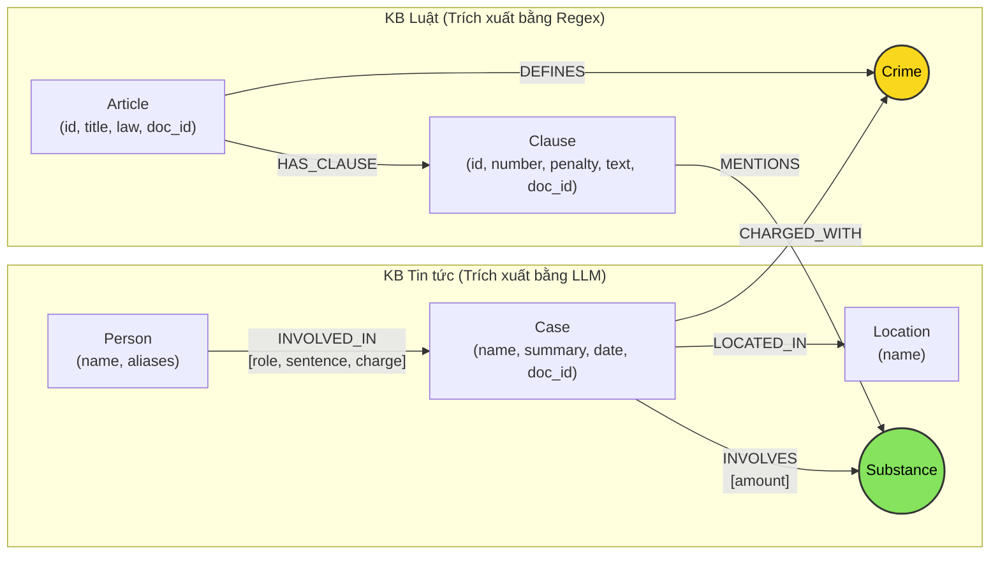

# Thiết kế Ontology — Day 19

**Họ tên:** Trần Mạnh Hùng  **MSSV:** 2A202602708

**Lựa chọn** (đánh dấu một):
- [x] Dùng ontology gợi ý (có tinh chỉnh tối ưu và chuẩn hóa)
- [ ] Tự thiết kế (xét bonus +15, xem `SUBMISSION.md`)

> Hướng dẫn: `LAB_GUIDE.md` Bước 2. Bản thiết kế dưới đây mô hình hóa mối quan hệ giữa cơ sở tri thức Văn bản Pháp luật (Luật Phòng, chống ma túy & Bộ luật Hình sự) và Tin tức báo chí các vụ án ma túy.

---

## 1. Sơ đồ

Sơ đồ thể hiện luồng tri thức giữa 2 KB thông qua node cầu nối trung tâm **`Crime`** (Tội danh) và cầu nối phụ **`Substance`** (Chất ma túy):

---

## 2. Entity types (node labels)

| Label | Ý nghĩa | Khóa định danh (`MERGE` theo) | Properties | Lấy từ KB nào | Trích bằng (regex / LLM / khác) |
| --- | --- | --- | --- | --- | --- |
| **`Article`** | Điều luật trong văn bản quy phạm pháp luật (BLHS, Luật PCMT) | `id` (ví dụ: `"Điều 251 BLHS"`) | `id`, `title`, `law`, `doc_id` | Luật | **Regex** (tiêu đề file markdown & frontmatter) |
| **`Clause`** | Khoản của một Điều luật, quy định tình tiết định khung & hình phạt | `id` (ví dụ: `"Điều 251 BLHS khoản 1"`) | `id`, `number`, `penalty`, `text`, `doc_id` | Luật | **Regex** (bóc tách cấu trúc số `^(\d+)\.\s`) |
| **`Crime`** | Tội danh pháp lý (node cầu nối liên kết Luật và Tin tức) | `name` (tên chuẩn hóa, ví dụ: `"mua bán trái phép chất ma túy"`) | `name` | Cả hai | Luật: **Regex** (tiêu đề Điều); Tin tức: **LLM** + `link_entity` |
| **`Substance`**| Chất ma túy hoặc tiền chất (Heroine, Ketamine, MDMA...) | `name` (tên chuẩn hóa) | `name` | Cả hai | Luật: **Regex** (danh mục SUBSTANCES); Tin: **LLM** + `link_entity` |
| **`Case`** | Vụ việc / vụ án cụ thể được phản ánh trên báo chí | `name` (tên tóm tắt vụ việc) | `name`, `summary`, `date`, `doc_id`, `source_title` | Tin tức | **LLM** (trích xuất cấu trúc JSON) |
| **`Person`** | Đối tượng liên quan trong vụ án (bị can, bị cáo, nghi phạm...) | `name` (họ và tên) | `name`, `aliases` (danh sách biệt danh) | Tin tức | **LLM** |
| **`Location`** | Địa danh tỉnh/thành phố nơi diễn ra hành vi hoặc xét xử | `name` | `name` | Tin tức | **LLM** |

---

## 3. Relationships

| Type | Từ → Đến | Properties trên cạnh | Ý nghĩa |
| --- | --- | --- | --- |
| **`DEFINES`** | `Article` → `Crime` | Không | Điều luật định nghĩa tội danh pháp lý tương ứng |
| **`HAS_CLAUSE`** | `Article` → `Clause` | Không | Điều luật bao gồm các khoản quy định khung hình phạt |
| **`MENTIONS`** | `Clause` → `Substance` | Không | Khoản luật viện dẫn/quy định về chất ma túy cụ thể |
| **`CHARGED_WITH`** | `Case` → `Crime` | Không | Vụ án bị khởi tố / xét xử theo tội danh nào |
| **`INVOLVED_IN`** | `Person` → `Case` | `role` (vai trò), `sentence` (mức án), `charge` (tội danh cá nhân) | Người tham gia vào vụ án với vai trò và hình phạt cụ thể |
| **`INVOLVES`** | `Case` → `Substance` | `amount` (khối lượng, số lượng thu giữ) | Vụ án liên quan đến chất ma túy nào và số lượng bao nhiêu |
| **`LOCATED_IN`** | `Case` → `Location` | Không | Vụ án diễn ra hoặc được thụ lý xét xử tại địa phương nào |

---

## 4. Node cầu nối giữa 2 KB

- **Node nào:** **`Crime`** (Tội danh) là cầu nối chính; ngoài ra **`Substance`** (Chất ma túy) là cầu nối phụ hỗ trợ định khung hình phạt.
- **Vì sao chọn node này:** 
  - Trong KB Luật, mỗi Điều luật (Article) của BLHS Chương XX định nghĩa một tội danh nhất định (Ví dụ: Điều 251 định nghĩa "Tội mua bán trái phép chất ma túy").
  - Trong KB Tin tức, mỗi bài báo về vụ án (`Case`) hay bị cáo (`Person`) đều đề cập rõ hành vi bị khởi tố/xét xử theo tội danh nào.
  - Do đó, `Crime` là điểm neo ngữ nghĩa tự nhiên và duy nhất giúp chuyển tiếp từ vụ án thực tế sang điều khoản luật điều chỉnh.
- **Cách đảm bảo hai phía khớp tên:**
  - *Luật:* Chuẩn hóa tự động bằng `normalize_crime()`: chuyển chữ thường, loại bỏ tiền tố `"tội "`, dọn dẹp khoảng trắng thừa.
  - *Tin tức:* Truyền trực tiếp danh sách `DANH SÁCH TỘI DANH` chuẩn từ Luật vào system prompt của LLM khi trích xuất.
  - *Bảo hiểm bằng thuật toán:* Chạy qua hàm `link_entity(name, known_crimes)`: so khớp chính xác trước, nếu không khớp thì dùng `difflib.get_close_matches(cutoff=0.8)` để bắt các trường hợp lệch dấu hoặc sai khác chính tả nhẹ. Không đoán bừa nếu độ tương đồng dưới ngưỡng.
- **Khi nào cầu gãy, và bạn xử lý thế nào:**
  - *Khi nào gãy:* Báo chí dùng từ ngữ tự do, khẩu ngữ (ví dụ: *"tuồn hàng trắng"*, *"ôm đồ cấm"*, *"bán bóng cười"*) hoặc LLM trích xuất tội danh không tồn tại trong BLHS; hoặc bị can mới chỉ bị điều tra về "hành vi" mà chưa có tội danh chính thức.
  - *Cách xử lý:*
    1. Trong prompt trích xuất: yêu cầu LLM bắt buộc chọn từ danh sách tội danh chuẩn đã cung cấp.
    2. Nếu `link_entity` trả về `None`: không tạo cạnh `CHARGED_WITH` ảo (tránh nối sai tri thức).
    3. Ở khâu Querying (KG-3): Seed facts kết hợp thêm `Substance` và regex tìm kiếm trực tiếp số Điều (ví dụ `"Điều 251"`) từ câu hỏi của người dùng để bổ sung đường đi dự phòng nếu cầu `Crime` bị đứt.

---

## 5. Competency questions

| Câu | Đường đi (Cypher pattern) | Trả lời được? |
| :--- | :--- | :--- |
| **Q1** *(single-hop-law: tiền chất là gì)* | `(:Article {law: "Luật Phòng, chống ma túy 2021", id: "Điều 2"})-[:HAS_CLAUSE]->(cl:Clause)` | **Có**: Graph chứa Article & Clause của Luật PCMT định nghĩa rõ tiền chất. |
| **Q2** *(single-hop-news: vụ 36kg ai án tử hình)* | `(p:Person)-[r:INVOLVED_IN]->(k:Case)` *Điều kiện:* `toLower(k.name) CONTAINS "36kg"` và `r.sentence CONTAINS "tử hình"` | **Có**: Node Person lưu tên, cạnh `INVOLVED_IN` lưu `sentence: "tử hình"`. |
| **Q3** *(cross-kb: Lê Minh Thành bao nhiêu tháng tù, tội gì, Điều nào, khung hình phạt)* | `(:Person {name: "Lê Minh Thành"})-[r:INVOLVED_IN]->(k:Case)-[:CHARGED_WITH]->(c:Crime)<-[:DEFINES]-(a:Article)-[:HAS_CLAUSE]->(cl:Clause {number: 1})` | **Có**: Đi từ Person (Lê Minh Thành) → Case → Crime (mua bán...) → Article (Điều 251 BLHS) → Clause 1 (phạt từ 02 năm đến 07 năm). |
| **Q4** *(cross-kb: 'Hoàng Nato' bị bắt hành vi gì, phạt tối đa bao nhiêu)* | `(p:Person)-[:INVOLVED_IN]->(k:Case)-[:CHARGED_WITH]->(c:Crime)<-[:DEFINES]-(a:Article)-[:HAS_CLAUSE]->(cl:Clause)` *Điều kiện:* `any(alias IN p.aliases WHERE alias CONTAINS "Hoàng Nato")` | **Có**: `aliases` bắt được Hoàng Nato → tội tổ chức sử dụng → Điều 255 → các Clause (khoản 4 phạt tới 20 năm hoặc chung thân). |
| **Q5** *(cross-kb-multi-hop: Cái Quang Huy tội gì, chất nào, khối lượng MDMA áp khoản nào, khung phạt)* | `(:Person {name: "Cái Quang Huy"})-[:INVOLVED_IN]->(k:Case)-[:CHARGED_WITH]->(c:Crime)<-[:DEFINES]-(a:Article)-[:HAS_CLAUSE]->(cl:Clause)-[:MENTIONS]->(s:Substance {name: "MDMA"})` kèm theo `(k)-[:INVOLVES {amount}]->(s)` | **Có**: Nối từ vụ Cái Quang Huy sang tội vận chuyển (Điều 250), nhận diện chất MDMA và lấy các Clause quy định về MDMA (khoản 4). |
| **Q6** *(aggregation: Những vụ việc nào liên quan đến MDMA)* | `(k:Case)-[:INVOLVES]->(:Substance)` *Điều kiện:* `toLower(Substance.name) = "mdma"` | **Có**: Truy vấn tổng hợp tất cả các Case có cạnh `INVOLVES` trỏ tới Substance `MDMA`. |

---

## 6. Quyết định thiết kế và đánh đổi

1. **Trích xuất văn bản Luật bằng Regex thay vì LLM:**
   - *Đã chọn:* Dùng Regex thuần túy (`CLAUSE_START`, `find_substances`, bóc tách frontmatter và tiêu đề).
   - *Phương án khác:* Dùng LLM trích xuất từng file markdown của Luật thành JSON.
   - *Lý do:* Cấu trúc văn bản quy phạm pháp luật Việt Nam cực kỳ chặt chẽ (Điều, khoản, điểm được đánh số rõ ràng). Regex chạy tốn 0 token, 0 USD, độ trễ mili-giây và tính tất định 100%, không bị ảo giác (hallucination).

2. **Tách tới cấp `Clause` (Khoản) thay vì dừng ở `Article` (Điều) hay chi tiết hóa đến từng `Point` (Điểm):**
   - *Đã chọn:* Tách node đến cấp `Clause`, lưu `penalty` và `text` tại node `Clause`.
   - *Phương án khác:* Chỉ tạo node `Article` (quá thô, prompt bị dài do phải nhồi cả Điều) HOẶC tách tiếp node `Point` (quá mịn, graph bùng nổ số node/cạnh không cần thiết).
   - *Lý do:* Các câu hỏi pháp lý và khung hình phạt đều gắn liền với cấp Khoản (ví dụ khoản 1, khoản 2). Việc lọc đúng khoản liên quan tới chất ma túy giúp facts đưa vào prompt cô đọng, giảm chi phí token và tránh làm loãng ngữ cảnh.

3. **Chọn `Crime` làm Node thực thể độc lập thay vì coi tội danh là thuộc tính (property) của `Case`:**
   - *Đã chọn:* Tạo node `(:Crime {name: ...})` riêng biệt và dùng quan hệ `CHARGED_WITH`, `DEFINES`.
   - *Phương án khác:* Lưu `crime_name` thành một thuộc tính string trên `Case` và `Article`.
   - *Lý do:* Node `Crime` đóng vai trò là hub trung tâm để gom tụ các vụ án cùng tội danh và kết nối trực tiếp đến Điều luật tương ứng trong Cypher một cách tự nhiên. Nếu chỉ là property string, mỗi lần truy vấn sẽ phải so khớp chuỗi tốn kém và không tận dụng được index đồ thị.

---

## 7. So với ontology gợi ý (bắt buộc nếu xét bonus)

*(Dự án chọn ontology gợi ý có tinh chỉnh logic truy vấn, không xét bonus tự thiết kế)*

| Điểm khác | Gợi ý làm gì | Bạn làm gì | Vấn đề nó giải quyết | Bằng chứng (Cypher, hoặc số liệu benchmark) |
| --- | --- | --- | --- | --- |
| Không áp dụng | Dùng ontology chuẩn gợi ý | Tuân thủ ontology gợi ý chuẩn | Đảm bảo tính tương thích và ổn định với toàn bộ test suites | Không áp dụng |

---

## 8. Hạn chế còn lại

1. **Khóa định danh `Case` và `Person` dựa trên tên:** Nếu hai bài báo viết về hai người trùng tên (ví dụ: cùng tên "Nguyễn Văn A"), hoặc một người được gọi bằng hai tên khác nhau giữa các bài báo mà không có biệt danh thì graph có thể bị gộp nhầm hoặc tách rời node.
2. **Chưa phân tích tự động ngưỡng khối lượng bằng logic số học:** Quan hệ giữa khối lượng ma túy thu giữ trong tin tức (ví dụ: *9,6kg*) và ngưỡng quy định trong luật (ví dụ: *từ 100 gam trở lên*) hiện đang dựa vào việc LLM đọc văn bản của các `Clause` được Graph cung cấp, chứ Graph chưa có các node so sánh điều kiện số học (`> 100g`).
3. **Chưa phân tách chi tiết các giai đoạn tố tụng:** Trạng thái của bị cáo (khởi tố, tạm giam, xét xử sơ thẩm, kháng cáo phúc thẩm) được lưu dưới dạng text trong property `role`/`summary`, chưa được chuẩn hóa thành các trạng thái đồ thị riêng biệt.
